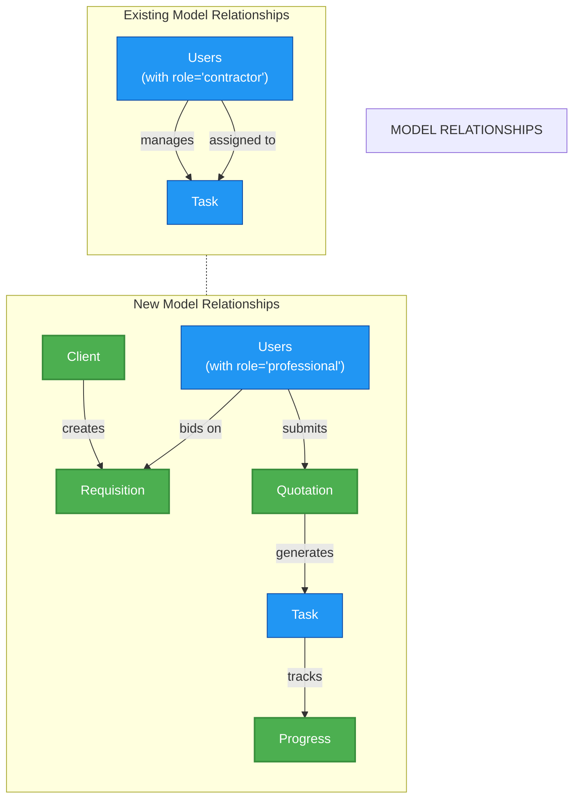
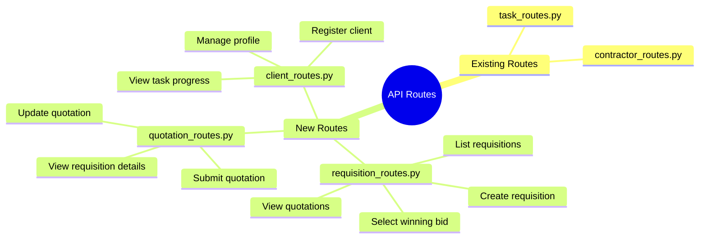
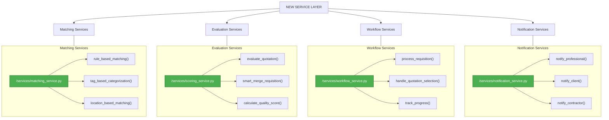
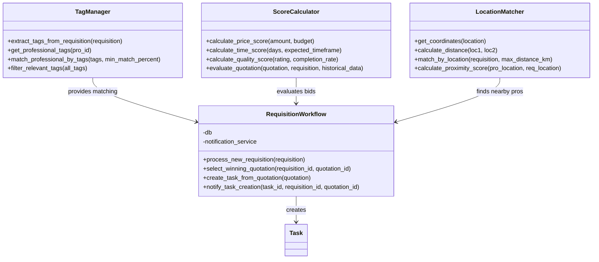
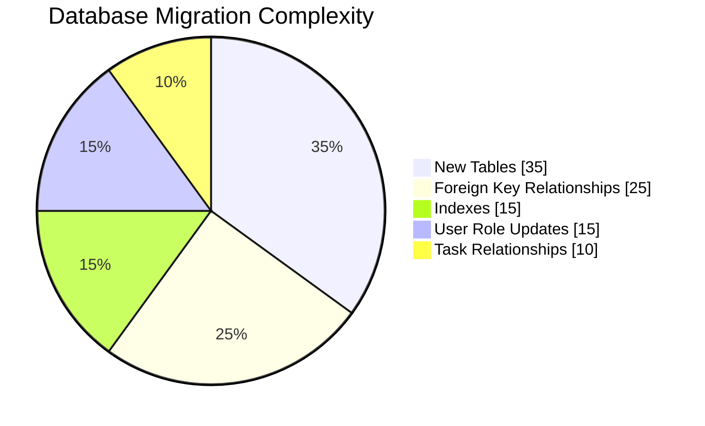
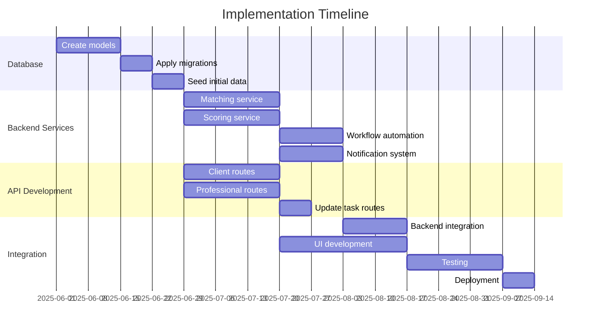
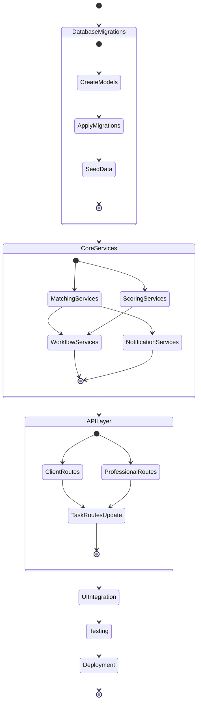

# Repository Impact Analysis - Smart Requisition System

This document highlights where in the MerchP.A backend code repository we would implement changes to introduce the smart requisition system without complex AI implementation.

## 1. Directory Structure Impact

```mermaid
flowchart TB
    classDef new fill:#4CAF50,stroke:#388E3C,color:white,stroke-width:2px
    classDef modified fill:#FFC107,stroke:#FFA000,color:black,stroke-width:2px
    classDef existing fill:#2196F3,stroke:#0D47A1,color:white,stroke-width:1px
    classDef heading fill:#607D8B,stroke:#37474F,color:white,stroke-width:2px,font-weight:bold

    title["DIRECTORY STRUCTURE IMPACT"]:::heading
    
    existing["EXISTING FILES"]:::heading
    usersFile["models/users.py"]:::existing
    taskFile["models/task.py"]:::existing
    taskRoutesFile["apis/task_routes.py"]:::existing
    seedUsersFile["seed/seed_users.py"]:::existing
    
    mUsers["Add client & professional fields"]:::modified
    mTask["Enhance relationship with new models"]:::modified
    mTaskRoutes["Extend with quotation handling"]:::modified
    mSeedUsers["Add client seeding"]:::modified
    
    usersFile --> mUsers
    taskFile --> mTask
    taskRoutesFile --> mTaskRoutes
    seedUsersFile --> mSeedUsers
    
    new["NEW FILES"]:::heading
    
    newModels["MODELS"]:::heading
    reqModel["requisition.py"]:::new
    quotModel["quotation.py"]:::new
    progModel["progress.py"]:::new
    
    newAPIs["APIs"]:::heading
    reqRoutes["requisition_routes.py"]:::new
    quotRoutes["quotation_routes.py"]:::new
    clientRoutes["client_routes.py"]:::new
    
    newServices["SERVICES"]:::heading
    matchService["matching_service.py"]:::new
    scoreService["scoring_service.py"]:::new
    
    newSeed["SEED DATA"]:::heading
    seedReq["seed_requisitions.py"]:::new
    seedQuot["seed_quotations.py"]:::new
    
    title --> existing
    title --> new
    
    new --> newModels
    new --> newAPIs
    new --> newServices
    new --> newSeed
    
    newModels --> reqModel
    newModels --> quotModel
    newModels --> progModel
    
    newAPIs --> reqRoutes
    newAPIs --> quotRoutes
    newAPIs --> clientRoutes
    
    newServices --> matchService
    newServices --> scoreService
    
    newSeed --> seedReq
    newSeed --> seedQuot
```

## 2. Model Relationships Impact

## 3. API Routes Impact

## 4. Service Layer Implementation

## 5. Core Implementation Logic

## 6. Database Migration Impact

## 7. Implementation Timeline & Phases

## 8. Implementation Workflow

## Key Implementation Files and Changes

| Type | File Path | Change Type | Priority | Description |
|------|-----------|-------------|----------|-------------|
| Model | `/models/requisition.py` | New | High | Stores client service requests and metadata |
| Model | `/models/quotation.py` | New | High | Stores professional bids on requisitions |
| Model | `/models/progress.py` | New | Medium | Tracks task progress and milestone completion |
| Model | `/models/users.py` | Modify | High | Add client role and professional attributes |
| API | `/apis/requisition_routes.py` | New | High | Client-facing endpoints for requisition management |
| API | `/apis/quotation_routes.py` | New | High | Professional-facing endpoints for bidding |
| API | `/apis/task_routes.py` | Modify | Medium | Update to handle tasks created from quotations |
| Service | `/services/matching_service.py` | New | High | Rule-based matching algorithms |
| Service | `/services/scoring_service.py` | New | High | Bid evaluation and ranking logic |
| Service | `/services/workflow_service.py` | New | Medium | Process automation for requisition workflow |
| Migration | `migrations/versions/new_migration.py` | New | High | Database schema updates for new models |
| Seed | `/seed/seed_clients.py` | New | Medium | Sample data for client testing |
| Seed | `/seed/seed_requisitions.py` | New | Medium | Sample data for requisition testing |

This implementation strategy focuses on practical, rule-based approaches rather than complex AI, while still delivering a comprehensive requisition automation system.
