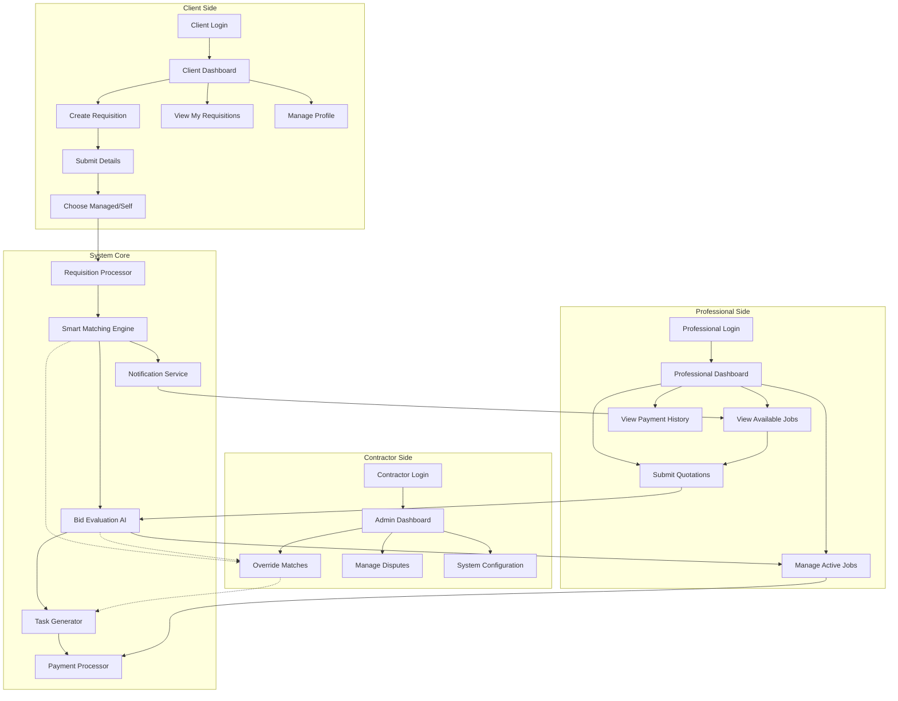
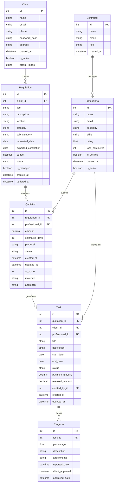
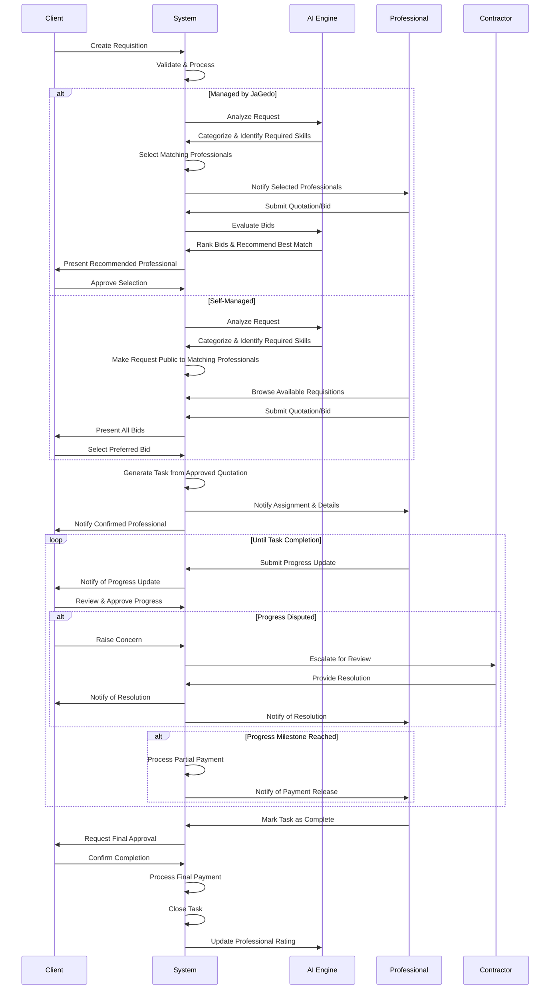
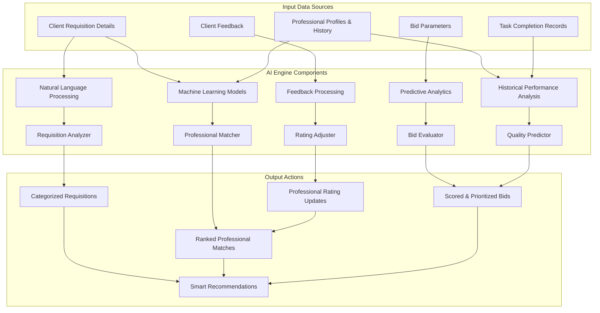

# Requisition System Integration Guide

## Overview

This document provides a comprehensive guide for integrating a requisition system with the MerchP.A backend, automating the process of connecting clients with professionals through an intelligent matching system.

## Table of Contents

1. [System Architecture](#system-architecture)
2. [Database Schema Enhancements](#database-schema-enhancements)
3. [Requisition Process Flow](#requisition-process-flow)
4. [AI Integration Components](#ai-integration-components)
5. [Implementation Strategy](#implementation-strategy)
6. [API Endpoints](#api-endpoints)
7. [Technology Stack](#technology-stack)
8. [Security Considerations](#security-considerations)

## System Architecture

The requisition system is designed as a three-sided marketplace connecting:
- **Clients** who submit service requisitions
- **Professionals** who bid on and execute jobs
- **Contractors** who oversee and manage the process

The architecture employs an AI-powered matching engine to automate the pairing of clients with qualified professionals, reducing the need for manual intervention by contractors.

## Database Schema Enhancements

### New Models

1. **Client Model**
   - Represents service requesters
   - Contains basic user information plus specific client attributes

2. **Requisition Model**
   - Stores details of client service requests
   - Linked to client and categorized by service type
   - Tracks whether managed by platform or self-managed

3. **Quotation Model**
   - Records professional bids on requisitions
   - Contains pricing, timeline, and approach details
   - Includes AI-generated score for quality prediction

4. **Progress Model**
   - Tracks milestone completion for assigned tasks
   - Enables partial payment releases
   - Stores client approval status

### Model Relationships

- Clients create Requisitions
- Professionals submit Quotations for Requisitions
- Approved Quotations generate Tasks
- Tasks track Progress milestones
- Contractors manage the overall process with minimal intervention

## Requisition Process Flow

### Client-Initiated Flow

1. Client submits a detailed requisition
2. Client chooses between platform-managed or self-managed process
3. System processes and categorizes the requisition
4. Matching professionals are notified or can browse available jobs
5. Professionals submit quotations (bids)
6. System or client selects winning bid
7. Task is created and professional is assigned
8. Progress is tracked in milestones
9. Payments are released at milestones
10. Final approval and payment upon completion

### AI-Assisted Automation

- Requisition categorization using NLP
- Professional matching using ML algorithms
- Bid evaluation using predictive analytics
- Quality prediction based on historical performance
- Automatic payment releases tied to verified progress

## AI Integration Components

## Implementation Strategy

### Phase 1: Core Infrastructure

1. Implement new database models
2. Create authentication for client users
3. Build requisition submission system
4. Develop professional profile enhancements
5. Create basic matching algorithm

### Phase 2: Smart Matching

1. Implement AI-based requisition analyzer
2. Develop professional capability matcher
3. Build quotation evaluation system
4. Create intelligent bid ranking system
5. Implement contractor override capabilities

### Phase 3: Workflow Automation

1. Build milestone tracking system
2. Implement automatic payment releases
3. Develop quality assessment system
4. Create dispute resolution workflow
5. Build comprehensive notification system

### Phase 4: Advanced AI Integration

1. Implement machine learning for quality prediction
2. Develop smart pricing recommendations
3. Build fraud detection system
4. Create continuous improvement feedback loop
5. Implement dynamic professional rating system

## API Endpoints

### Client API

- `POST /api/clients/register` - Register new client
- `POST /api/requisitions` - Create new requisition
- `GET /api/requisitions` - List client requisitions
- `GET /api/requisitions/{id}` - Get requisition details
- `GET /api/requisitions/{id}/quotations` - View quotations for requisition
- `POST /api/requisitions/{id}/select` - Select winning quotation
- `GET /api/tasks/{id}/progress` - View task progress
- `POST /api/tasks/{id}/approve` - Approve milestone

### Professional API

- `GET /api/requisitions/available` - Browse available requisitions
- `POST /api/requisitions/{id}/quotations` - Submit quotation
- `GET /api/tasks/assigned` - View assigned tasks
- `POST /api/tasks/{id}/progress` - Update task progress
- `POST /api/tasks/{id}/complete` - Mark task as complete

### Contractor API

- `GET /api/requisitions/all` - View all requisitions
- `GET /api/quotations/all` - View all quotations
- `POST /api/quotations/{id}/override` - Override matching
- `GET /api/disputes` - View disputes
- `POST /api/disputes/{id}/resolve` - Resolve dispute

### AI Service API

- `POST /api/ai/analyze-requisition` - Analyze and categorize requisition
- `POST /api/ai/match-professionals` - Find matching professionals
- `POST /api/ai/evaluate-bids` - Score and rank quotations
- `POST /api/ai/update-ratings` - Update professional ratings

## Technology Stack

### Backend

- **Flask/Python** - Core API framework
- **SQLAlchemy** - ORM for database operations
- **PostgreSQL** - Primary database
- **Redis** - Caching and queue management
- **Celery** - Background task processing

### AI Components

- **TensorFlow/PyTorch** - ML model training
- **Scikit-learn** - Feature engineering
- **NLTK/spaCy** - Natural language processing
- **Pandas** - Data analysis and manipulation

### Integration Points

- **Payment Gateway** - For processing payments
- **Notification Service** - For SMS/email notifications
- **File Storage** - For document attachments
- **Geocoding Service** - For location-based matching

## Security Considerations

- Implement role-based access control (RBAC)
- Encrypt sensitive data at rest and in transit
- Implement rate limiting on API endpoints
- Add comprehensive logging for audit trails
- Ensure GDPR compliance for user data
- Implement verification processes for professionals
- Add fraud detection for payment processing

## Conclusion

This integration will transform the MerchP.A backend into a fully automated requisition management system similar to JaGedo's platform. By leveraging AI, the system will minimize manual intervention while optimizing matching quality between clients and professionals.

The phased implementation approach ensures that the system can be built incrementally while maintaining existing functionality. Each phase adds new capabilities that enhance the overall user experience and operational efficiency.
